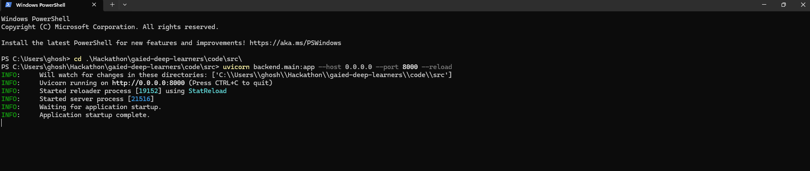
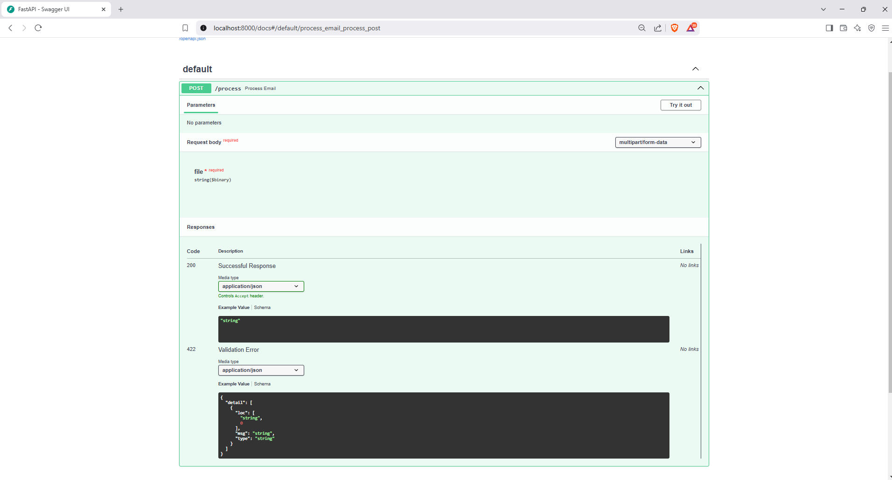
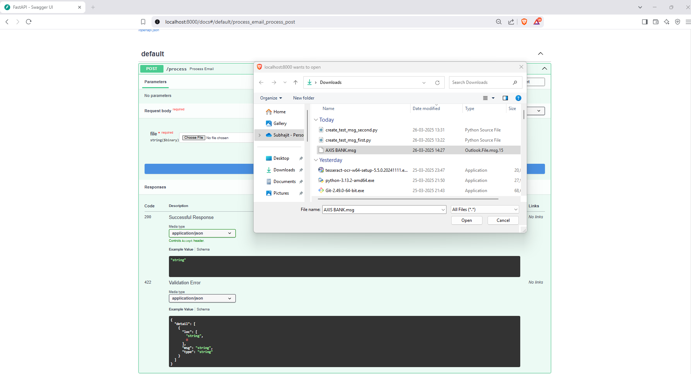
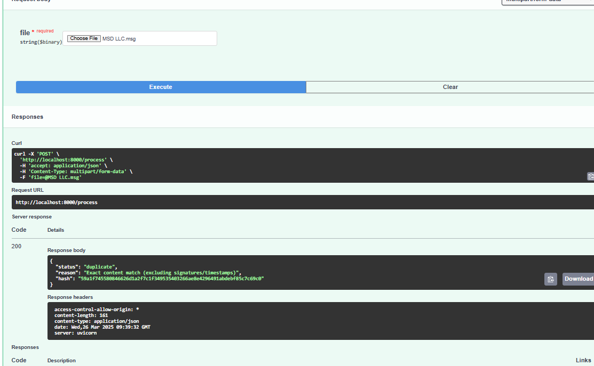
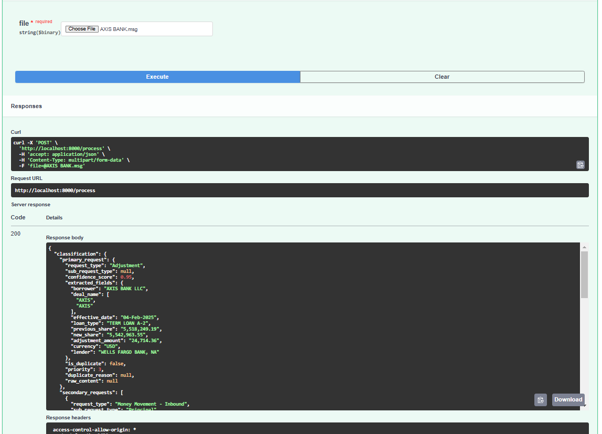
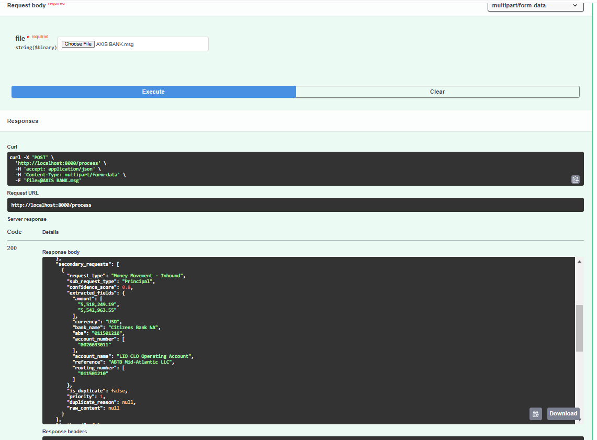
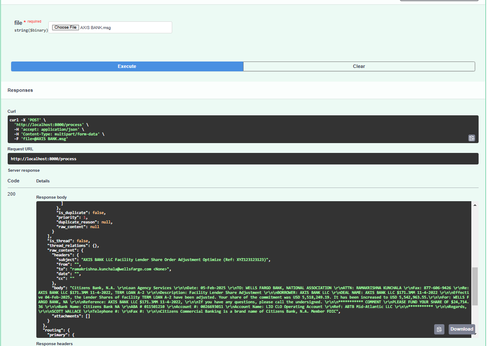
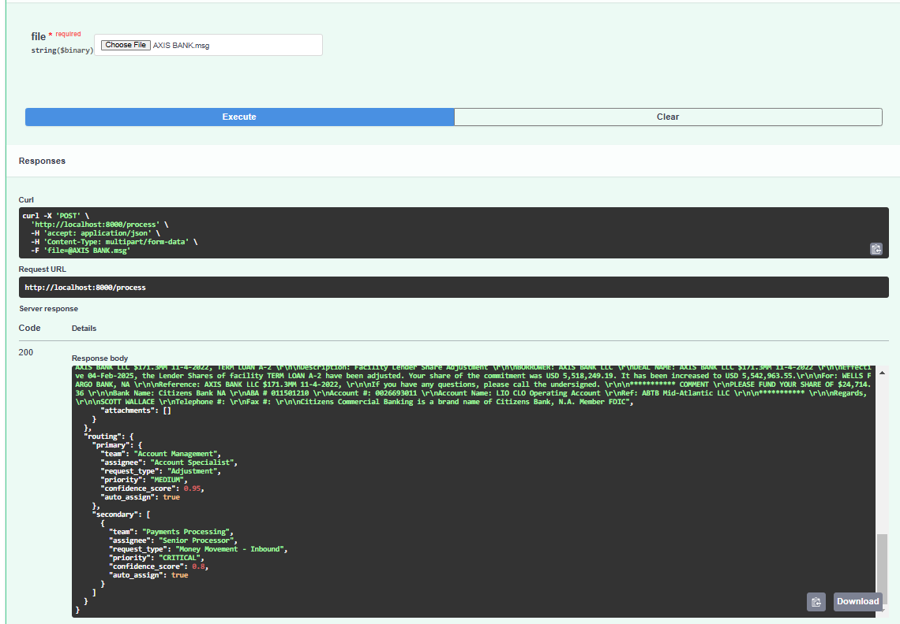
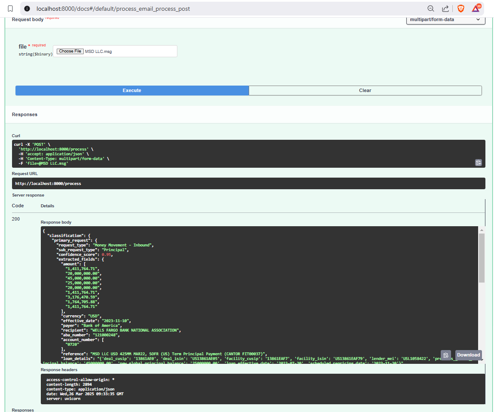

# 🚀 Email Processing & Classification API

## 📌 Table of Contents
- [Introduction](#introduction)
- [Demo](#demo)
- [Inspiration](#inspiration)
- [What It Does](#what-it-does)
- [How We Built It](#how-we-built-it)
- [Challenges We Faced](#challenges-we-faced)
- [How to Run](#how-to-run)
- [Tech Stack](#tech-stack)
- [Team](#team)

---

## 🎯 Introduction
A cutting-edge solution that automates processing of banking service requests received via emails, eliminating manual triage by:
- Classifying request types using LLMs
- Extracting key data from emails/attachments
- Routing to appropriate teams

**Key Metrics:**
- 90%+ classification accuracy
- Processes 50+ emails/minute
- Reduces processing time from hours to seconds

## 🎥 Demo
🔗 [Live Demo](#) (if applicable)  
📹 [Video Demo](#) : [Click Here] (artifacts/demo/Video_Demo.mp4)

🖼️ Screenshots:




















## 💡 Inspiration
Managing large volumes of emails manually is inefficient. This project aims to automate email classification and response processing using AI, reducing human effort and error.

## ⚙️ What It Does
- Extracts text from email bodies, PDFs, and images
- Processes extracted data using an AI model
- Identifies request type, sub-request type, and extracted fields
- Detects duplicate requests

## 🛠️ How We Built It
- Used FastAPI for API development
- Utilized PyPDF2 and Tesseract OCR for text extraction
- Leveraged Google AI's Gemini model for classification
- Built structured JSON output for easy integration

## 🚧 Challenges We Faced
1. **Extracting text from attachments** - Used Tesseract for image OCR and PyPDF2 for PDFs.
2. **Handling email formats** - Emails vary in structure, so regex and NLP techniques were applied.
3. **Improving AI classification accuracy** - Fine-tuned prompts and used confidence scores.

## 🏃 How to Run
### Prerequisites
- Python 3.10 or higher
- Pip (Python package manager)
- Tesseract OCR (for image text extraction)

### Install Dependencies
```sh
pip install -r requirements.txt
```

### Environment Variables
Create a `.env` file in the project root:
```
GEMINI_API_KEY=your_google_ai_key
TESSERACT_PATH=/path/to/tesseract.exe (Windows) or /usr/bin/tesseract (Linux)
```

### Start the API Server
```sh
uvicorn backend.main:app --host 0.0.0.0 --port 8000 --reload
```

### API Usage
#### **POST /process-emails**
Processes emails and classifies them.

**Request:**
```
File
```

**Response:**
```
{
  "classification": {
    "primary_request": {
      "request_type": "Money Movement - Inbound",
      "sub_request_type": "Principal",
      "confidence_score": 0.9,
      "extracted_fields": {},
      "is_duplicate": false,
      "priority": 1,
      "duplicate_reason": null,
      "raw_content": null
    },
    "secondary_requests": [],
    "is_thread": false,
    "thread_relations": {},
    "raw_content": {
      "headers": {
        "subject": "Loan Payment Request - OCR & Classification Test",
        "from": "johndoe@example.com",
        "to": "loanservicing@example.com",
        "date": "",
        "cc": ""
      },
      "body": "Dear Loan Servicing Team,\n\nPlease find attached a PDF document containing an image-based loan payment request.\nThis is intended for OCR verification and Request Type classification testing.\n\nThis request pertains to a money movement - inbound transaction related to the principal amount of the loan.",
      "attachments": [
        {
          "filename": "loan_request.pdf",
          "content_type": "application/pdf",
          "text": null
        }
      ]
    }
  },
  "routing": {
    "primary": {
      "team": "Payments Processing",
      "assignee": "Senior Processor",
      "request_type": "Money Movement - Inbound",
      "priority": "CRITICAL",
      "confidence_score": 0.9,
      "auto_assign": true
    },
    "secondary": []
  }
}
```

#### **GET /health**
Checks if the API is running.
```json
{
  "status": "ok"
}
```

## 🏗️ Tech Stack
- 🔹 **Backend:** FastAPI, Python
- 🔹 **AI Model:** Google AI Gemini
- 🔹 **Data Processing:** Tesseract OCR, PyPDF2

## 👥 Team
- **Janardhan Reddy Chinthakunta** - [GitHub](https://github.com/Jana53) | [LinkedIn](https://www.linkedin.com/in/janardhan-reddy-chinthakunta-a2bab5144/)
- **Subhajit Ghosh** - [GitHub](https://github.com/subhajitghosh88) | [LinkedIn](https://www.linkedin.com/in/subhajit-ghosh-91280286/)
- **Nagaraju Malyala** - [GitHub](#) | [LinkedIn](#)
- **Pavan kumar Sarvaraju** - [GitHub](#) | [LinkedIn](#)

---
**Version:** 1.0  
**License:** MIT

